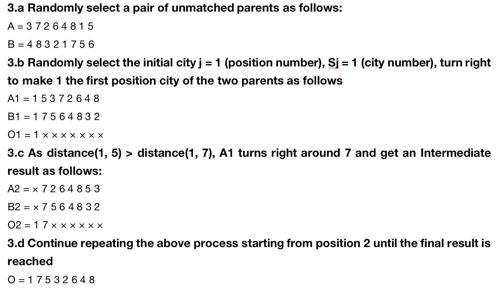

# Genetic Algorithm for Travelling Salesman Problem

This project is a Genetic Algorithm solution for the Travelling Salesman Problem (TSP).
This is a homework assigment for CSCI561 Foundation of Artificial Intelligence

## Background
TSP is defined as given a list of cities/locations, the person has to go to all the locations exactly once, return back to the starting point, and cover the minimum distance as a whole.
<p align="center"></p>
A location is represented as a combination of 3D coordinate points, x, y, and z. For example: (10, 0, 30) represents a city with x= 10, y = 0, z= 30.

## Steps
1. **Initial Population**
2. **Parent Selection:** Roulette wheel based
3. **Crossover:** HGA Based
<p align="center"></p>

## How to Run the Algorithm
1. **Clone the Repository:**
   ```bash
   git clone https://github.com/darshanrao/Genetic_Algorithm-.git

## Install Dependencies
Ensure you have Python installed. Additionally, the algorithm uses standard libraries, so there's no need for additional installations.

## Input File
Provide the input coordinates in the `input.txt` file. The format is:
  ```bash
  <number_of_locations>
  <x1> <y1> <z1>
  <x2> <y2> <z2>
  ```

## Run the Algorithm:
Execute the following command:

```bash
   python genetic_algorithm.py
```
# Output
The algorithm will generate an `output.txt` file containing the best route and its corresponding distance.

## Algorithm Overview
- **Initial Population:**
  Randomly generates an initial population of routes.

- **Parent Selection:**
  Utilizes a Roulette Wheel selection method to choose parents based on their fitness.

- **Crossover:**
  Applies a Hybrid Genetic Algorithm (HGA) based crossover method to create offspring.

- **Mutation:**
  Introduces random mutations to diversify the population.

- **Termination:**
  The algorithm terminates after a specified maximum time or maximum number of generations.

## References
- [CSCI 561- Fall 2023-Homework 1.pdf](https://github.com/darshanrao/Genetic_Algorithm-TSP/blob/main/CSCI%20561-Fall%202023-Homework%201.pdf)
- [Solution of TSP problem based on a hybrid genetic simulated annealing algorithm.pdf](https://github.com/darshanrao/Genetic_Algorithm-TSP/blob/main/WCE2010_pp11-14.pdf)

Feel free to explore and modify the algorithm parameters for different TSP instances. If you encounter any issues or have suggestions, please open an issue or pull request.

Happy coding!
